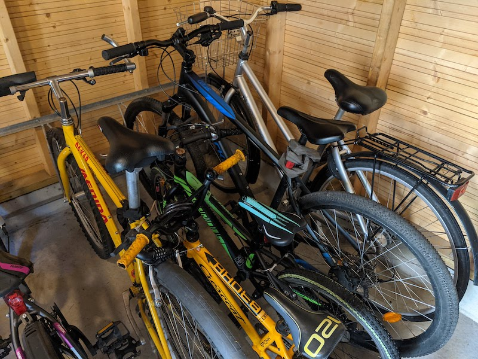
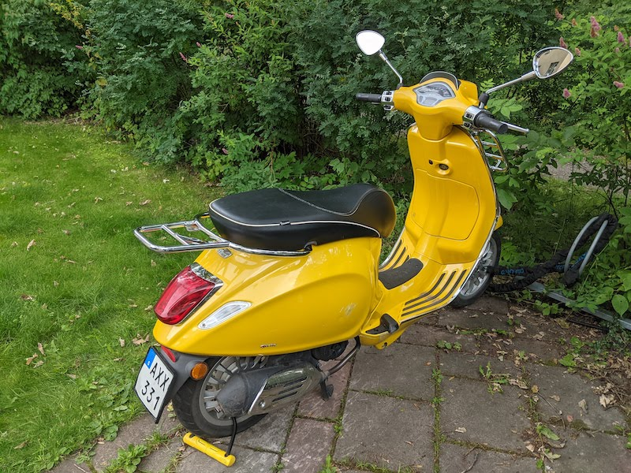

Soon your trip is starting, we wish you a safe journey to our home town!

## Finding the car

The car is [parked in P21](https://goo.gl/maps/zGuNXZYX5e2E3qzM8) in ground level (marked level 1).

Walk from terminal 5 through "Sky City" and past terminal 4. Look for a black van with plate no FAJ 36C. Parking is already paid, just insert the receipt when exiting the parking.

## Starting the car

The car has "keyless start", so ithe key only needs to be inside the car. The gear knob must to be in "P" mode when starting/stopping. Hold down the break pedal and press the start/stop button to start the car. Turn the knob to "R" for reverse or "D" for drive. It takes diesel as you know.

## Getting to our home

Our home is at [Odelbergsvägen 36](https://maps.app.goo.gl/MnZXymbNVhaMEpsV7).
It's a 40 min drive, here are rough directions:

- Take E4 towards Stockholm
- After 45 km, take exit 155 towards Nynäshamn
- After 4 km, take exit 73 towards Nynäshamn
- After 1 km, take Globen exit
- Turn right onto Enskedevägen
- After 1 km, turn right onto Palmfeltsvägen
- Turn left onto Odelbergsvägen

[The parking](https://goo.gl/maps/fkrwBh6w8dX17yF3A) is behind the opposite building, no 34.
Our parking lot is no 3.

## Our home

The main entrance opens with the apartment key, the plastic "blip" or by code 1425 (code works until 22:00).

We made the beds with clean sheets for you.
In the bathroom we put out towels for you also.

The WiFi is called "BigHero6" with password "oriavehl".

The trash room is located in the opposite building, to the right of the entrance. Use the apartment key to get in.

We left a cooler in the hallway which connects to the car cigarette outlet - could be useful on your trip to Gothenburg perhaps.

We also left frisbee discs and a screwdriver to adjust height of bike saddles.

The washing machine has "i-DOS" meaning it doses detergent automatically.
Refill with liquid detergent and make sure the "i-DOS" is lit on the display when starting a washing programme.

## Bikes and Vespa

There are bikes in the bike storage next to the parking if you want to borrow - use the apartment key to get in. We only have five bikes though. Code for the code locks is 5736.

We also have a Vespa if you feel adventurous (it's the one with the XLMOTO cover).
Bike keys and Vespa key is in the basket up to your right when you enter the apartment.
🛵💨

## Grocery shopping nearby

[Lidl](https://g.page/lidl-enskedefaltet?share) is where we ususally go shopping, it's open until 21.

[ICA Bea](https://goo.gl/maps/UKabastKbFz5EaD69)has groceries and on the lower floor tools, toys, clothes etc. Open until 22.

[ICA Globen](https://goo.gl/maps/fb3H6RK9nKg6sU1d6) open until 21.

[Systembolaget](https://goo.gl/maps/miv7Zt8h9VfHyjEE9) for wine, beer, liquor.

## In the neighbourhood

Egil recommends playing hide-and-seek in the park and a visit to the [Enskede ridskola](https://goo.gl/maps/xGZnhQ2JN1qENPCL8) to watch the horses. Take a walk through [Enskede Gårds koloniträdgårdar](https://goo.gl/maps/92fwDv2FyW5iJvB1A) and [Dahliaträdgården](https://goo.gl/maps/MEDM36yyeAqtdnNS6) to enjoy the flowers.

[Enskedeparkens bageri](https://maps.app.goo.gl/DHUysJhRCNU6yC4g7) is closed for summer and opens again August 4. It's our local café where you should try the cinnamon and cardamom buns.

[Vårflodsparken](https://maps.app.goo.gl/G1fCK2GiDCCVW6vx6) has a playground and a splash pad.

[Skogskyrkogården](https://goo.gl/maps/aW27BpJ2nDNzVKBs6) is one of three UNESCO world heritage sites in Stockholm. It's a huge cemetery with huge pine trees. The other two are [Drottningholms slott](https://goo.gl/maps/bsjjWLbtBEFzaDDN8) and [Birka viking island](https://goo.gl/maps/k49Mw1NCx2Hxjc2s9).

[Tolv Stockholm](https://goo.gl/maps/1eFS4QkupsnwanZr5) is underneath the Tele2 fotball arena and has bowling, fun golf, pool tables, restaurants etc.

[Globen shopping](https://goo.gl/maps/AEuHaHGQPBmrHpWK9) is our local mall, not too exciting, but has all kinds of shops and restaurants.

[Palmyra](https://goo.gl/maps/PeLK7cuxkbyf1foX9) in Årsta serves the best kebab in Stockholm

## Södermalm

[Mariatorget](https://goo.gl/maps/B7bCzf5L2fD9iKTBA) on Södermalm is a cosy area with second-hand shops [Stadsmissionen](https://goo.gl/maps/iYcXxe5ZXFzwnYWL9) and [Humana](https://g.page/second-hand-sodermalm?share). Alvar's favourite lunch place [Falafelbaren](https://g.page/falafelbaren?share) is around the corner. There's also [StikkiNikki](https://goo.gl/maps/7zBE7ydHQAUsXEeu6) icecream and [Lakritsroten](https://goo.gl/maps/NUhdMjE8B9XDdH9e7) all liqorice shop 😋. Make sure to visit [Mariaberget](https://goo.gl/maps/trKbbWdJAFFop2KBA) with old wooden houses and a great view of the city.

[Bryggartäppan](https://goo.gl/maps/oKEaQcSFr1i6Go1t8) playground in the style of old Södermalm. Nearby there's Katarina bangata with small shops and cafés. Close by there's [Nytorget](https://goo.gl/maps/thqwyonxynnffPQz7) which is a hipster hub of Södermalm. There's [Stadsmissionen](https://goo.gl/maps/gHMnDKGG7ShML3q57) second-hand as well as [Grandpa](https://g.page/grandpastore?share) and [Cocktail](https://goo.gl/maps/k9KAnYQJcQKyDCSPA) which are pretty fun shops to check out. A few blocks to the north you find [Amida kolgrill](https://goo.gl/maps/SGPyH4aE54TFUovX8) which serves really tasty oriental charcoal grilled meat meat and vegetables. Further to the 

## South Stockholm

[Sätraskogens discgolfbana](https://goo.gl/maps/Sys8SUrsU3L47wT99) has nice nature and disc golf! While in the area there's also Skärholmen market with fruits and vegetables.

[Bandängens parklek](https://goo.gl/maps/bdMMETFWuNLPZbf39) is a fun playground with a splash pad and some animals. Walking distance to the south you find [Burger mansion](https://g.page/theburgermansion?share) for lunch. Another 10 minute walk in Högdalen centrum there's Vide's favourite - [BABAS Burgers](https://goo.gl/maps/U5UyMRwtskUBV3cFA).

## Central Stockholm

[The old town](https://goo.gl/maps/7V6eFs4tEFY5Dhwr5) - enjoy the cobbled streets and houses from the 15th century

[Stockholms stadshus](https://maps.app.goo.gl/4719uNDowDXx13C28) - no need for the full tour, just buy separate ticket to go up the tower.

[Vasamuseet](https://maps.app.goo.gl/VGDjsHmyvSDkVL3t7) - the ship that sunk on it's maiden voyage 400 years ago and was later brought up from the bottom of the sea

[Skansen](https://maps.app.goo.gl/FuBs7BiyqApjywtT7) -  outdoor museum with Nordic animals, wild and domestic

[Tekniska museet](https://maps.app.goo.gl/82HnSZYNytbDoyVx9) - technical fun for young and old

## Other places

Check out the map of [our favourite places](https://drive.google.com/open?id=1NGujzVNI1lADjlOzOTOPcUww1ncUwS1S&usp=sharing)!

Also, check out the [Visit Stockholm](https://www.visitstockholm.com/) webpage for tips and up to date information about events such as the [pride parade](https://www.stockholmpride.org/evenemang/pride-parade/) which is fun to watch - it's at August 6 at 13:00 in central Stockholm.
